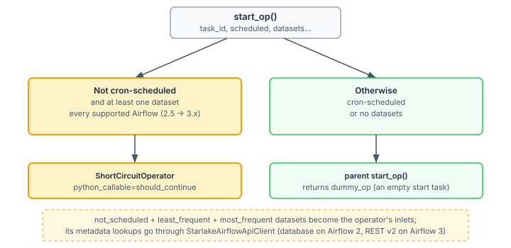
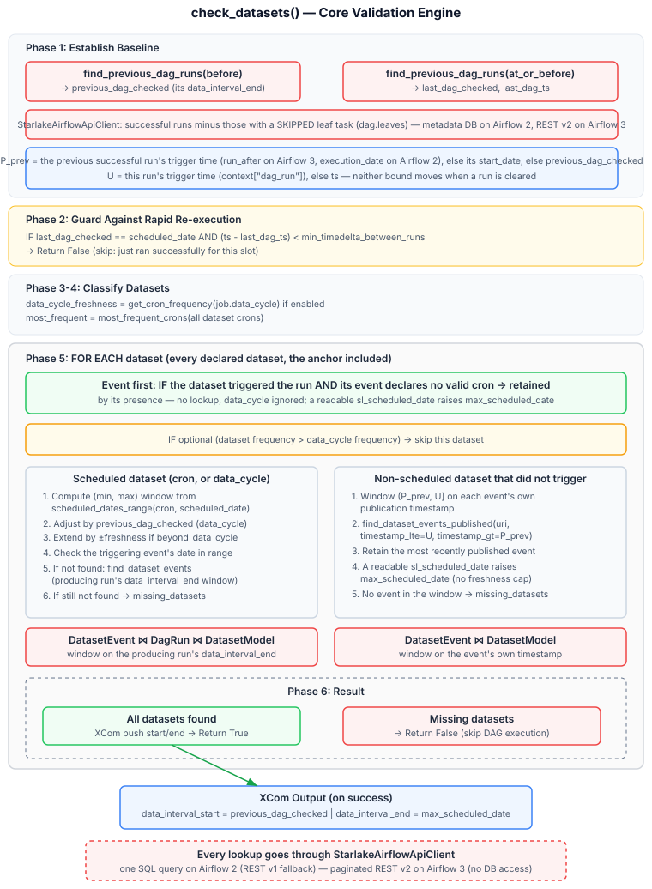
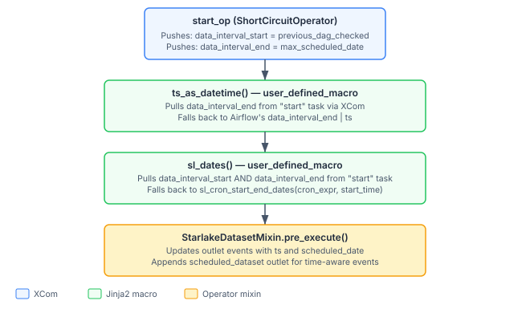
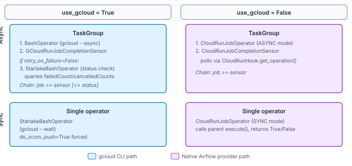

# Starlake Airflow — Architecture Reference

This document describes the internal architecture of the `starlake-airflow` module. It is intended for contributors, AI agents, and anyone extending the framework or migrating to Airflow 3.

For usage documentation, see [README.md](README.md).
For core module architecture, see [starlake-orchestration/ARCHITECTURE.md](../starlake-orchestration/ARCHITECTURE.md).

## Role Within the Framework

The Airflow module **concretizes** the core `starlake-orchestration` abstractions for Apache Airflow. It binds the four generic type variables:

| TypeVar | Airflow Concrete Type (resolved by `compat.py`) |
|---------|----------------------|
| `U` (pipeline) | `airflow.DAG` |
| `T` (task) | `BaseOperator` — `airflow.sdk.bases.operator` (3.x) / `airflow.models.baseoperator` (2.x) |
| `GT` (task group) | `TaskGroup` — `airflow.sdk` (3.x) / `airflow.utils.task_group` (2.x) |
| `E` (event) | `Dataset` — `airflow.sdk.Asset` (3.x) / `airflow.datasets.Dataset` (2.x) |

## Package Structure

```
ai.starlake.airflow/
├── compat.py                           Airflow 2/3 import fallbacks and version helpers
├── starlake_airflow_options.py         StarlakeAirflowOptions
├── starlake_airflow_api.py             StarlakeAirflowApiClient (metadata DB / REST v1 / REST v2),
│                                       DotDict, to_dotdict
├── starlake_airflow_job.py             StarlakeAirflowJob, AirflowDataset, StarlakeDatasetMixin,
│                                       StarlakeEmptyOperator, sl_options_from_events
├── starlake_airflow_orchestration.py   AirflowOrchestration, AirflowPipeline, AirflowTaskGroup
├── bash/
│   └── starlake_airflow_bash_job.py    StarlakeAirflowBashJob, StarlakeBashOperator, StarlakePythonOperator
├── gcp/
│   ├── starlake_airflow_cloud_run_job.py   StarlakeAirflowCloudRunJob, CloudRunJobOperator,
│   │                                       CloudRunJobCompletionSensor, GCloudRunJobCompletionSensor
│   └── starlake_airflow_dataproc_job.py    StarlakeAirflowDataprocJob, StarlakeAirflowDataprocCluster,
│                                           DataprocJobOperator, cluster config classes
└── aws/
    └── starlake_airflow_fargate_job.py     StarlakeAirflowFargateJob, FargateTaskOperator,
                                            FargateTaskStateSensor
```

## Airflow Version Compatibility

The module supports Airflow 2.4+ and Airflow 3.x from a single code base. All import fallbacks (`BaseHook`, `Dataset`/`Asset`, operators, sensors, `TaskGroup`, `get_current_context`, `TriggerRule`) and version helpers live in a single module, `compat.py`:

| Function | Condition | Impact |
|----------|-----------|--------|
| `supports_datasets()` | `>= 2.4.0` and `< 3.0.0` | Dataset-based APIs (metadata DB / REST v1) |
| `supports_inlet_events()` | `>= 2.10.0` | Enables inlet-based dataset triggering in `start_op()` |
| `supports_assets()` | `>= 3.0.0` | Asset-based APIs (REST v2, JWT auth) |
| `api_prefix()` | version-derived | `/api/v1` vs `/api/v2` |

Metadata lookups (datasets/assets, events, DAG runs, task instances) go through `StarlakeAirflowApiClient`, which selects its transport internally: the metadata database on Airflow 2 (REST v1 as fallback), REST v2 on Airflow 3. See **[COMPATIBILITY.md](COMPATIBILITY.md)** for the step-by-step reference, the parity analysis against the previous session-based implementation, and the per-version parameter translation tables.

## Class-by-Class Reference

### Configuration

#### `StarlakeAirflowOptions` (extends `StarlakeOptions`)

Overrides `get_context_var()` to add **Airflow Variable** as a resolution source:

```
Resolution order: options dict → default_value → Airflow Variable → environment variable
```

This allows DAG configuration via the Airflow UI Variables panel without code changes.

### Event/Dataset Layer

#### `AirflowDataset` (extends `AbstractEvent[Dataset]`)

Implements `to_event()` — converts a `StarlakeDataset` into an Airflow `Dataset` (2.x) / `Asset` (3.x, via `compat.Dataset`):

- Uses `dataset.uri` directly
- Populates `extra` with: `sl_uri`, `sl_cron`, `sl_freshness`, and optionally `source`

#### `StarlakeDatasetMixin`

A mixin applied as **first parent** to all Starlake-wrapped Airflow operators. This is the bridge between the Starlake dataset model and Airflow's native lineage/outlet system.

**`__init__()`**:
- Converts any `StarlakeDataset` **inlets** to Airflow `Dataset` events (issue #50 — Airflow 2 core JSON-serializes inlets to XCom in `post_execute`; only attrs classes survive)
- Pops the **`extra`** kwarg — free-form metadata published on the outlet events at runtime; this is where a DAG carries `sl_options` sections (see *Runtime options propagation* below). `extra` is a template field, so Jinja/XCom values inside it are rendered before publication
- If `dataset` is a `StarlakeDataset`: populates `params` with `uri`, `cron`, `sl_schedule_parameter_name`, `sl_schedule_format`; computes Jinja2 templates `scheduled_dataset` and `scheduled_date`; creates `Dataset` outlet with `extra` metadata
- If `dataset` is a string: creates outlet without scheduling metadata
- Adds `("scheduled_dataset", "scheduled_date", "extra")` to `template_fields` for Jinja2 rendering

**`render_template_fields()`**:
- Fallback injection: if the DAG's `user_defined_macros` don't include `ts_as_datetime`, `sl_scheduled_dataset`, `sl_scheduled_date`, or `sl_options_from_events`, injects them into the Jinja2 context. This handles operators that run outside a fully-configured SL pipeline.

**`pre_execute()`**:
- Updates `self.extra` with runtime `ts` timestamp
- Adds `scheduled_date` to extra if available
- Appends a `Dataset(uri=scheduled_dataset, extra=...)` outlet for time-aware dataset events
- Updates **all outlet events** with the computed extra metadata

(The previous implementation decorated `pre_execute` with `@prepare_lineage`; the decorator does not exist on Airflow 3 and is redundant on Airflow 2, where core `BaseOperator` already applies it.)

**Operators using this mixin:**
`StarlakeEmptyOperator`, `StarlakeBashOperator`, `StarlakePythonOperator`, `CloudRunJobOperator`, `CloudRunJobCompletionSensor`, `GCloudRunJobCompletionSensor`, `DataprocJobOperator`, `FargateTaskOperator`, `FargateTaskStateSensor`

#### Runtime options propagation (`sl_options`)

Run-scoped Starlake variables travel from a producing pipeline to the pipelines it triggers through the dataset/asset event `extra`, under the `StarlakeParameters.OPTIONS_PARAMETER` key (`sl_options`) as a dict of sections: `{"all": {key: value}, "<domain.task>": {key: value}}`.

**Writer side** — the producing task carries the sections in the mixin's `extra` template field; `pre_execute()` copies `self.extra` onto every outlet event, so the sections ride on the `DatasetEvent`/`AssetEvent` consumed by downstream DAGs.

**Reader side** — `sl_options_from_events(triggering_dataset_events, dag_run, name)` (module-level Jinja macro, registered in `user_defined_macros`) merges the sections carried by all triggering events. Merging is **fail-loud**: the same key carried with different values by coalesced events raises (conflicting run variables must stop the run). `dag_run.conf["sl_options"]` overrides events — the manual-recovery escape hatch. The rendered fragment (`key=value[,...]`, or `sl_options_applied=0` when nothing applies) is appended **last** to the transform command's `--options` by `sl_transform()`, so starlake's last-wins duplicate resolution yields the precedence: static options < `"all"` section < task-specific section.

The template context key differs per version: `sl_transform()` builds the fragment with `triggering_asset_events` on Airflow 3 and `triggering_dataset_events` on Airflow 2 (issue #54).

### Base Job — `StarlakeAirflowJob`

**Extends:** `IStarlakeJob[BaseOperator, Dataset]`, `StarlakeAirflowOptions`, `AirflowDataset`

The Airflow-specific base job factory. All execution environment jobs extend this class.

**`sl_orchestrator()`** → `StarlakeOrchestrator.AIRFLOW`

**Constructor** — beyond parent initialization:
- Resolves `pool` from context var (default: `"default_pool"`)
- Parses `end_date` from context var (YYYY-MM-DD format or None)
- Resolves `max_active_runs` from context var (default: 3)

**`default_dag_args()`** — returns a **copy** (the shared `DEFAULT_DAG_ARGS` constant is never mutated — the Airflow scheduler parses many DAG modules in one interpreter, issue #87) built with this precedence (lowest to highest):

1. `DEFAULT_DAG_ARGS` (module constant: depends_on_past=False, start_date=2023-01-01, retries=1, retry_delay=5min, max_active_runs=1)
2. JSON from the `default_dag_args` context var (if present)
3. `start_date` (always framework-derived from the DAG file) and the `retries` / `retry_delay` context vars **only when explicitly provided** — the core fallbacks (retries=1, retry_delay=300s) never clobber a value set via the JSON option

At pipeline level, `AirflowPipeline.__init__` merges `{**job.caller_globals.get('default_dag_args', {}), **job.default_dag_args()}` — the options-derived args win over the caller-module `default_dag_args` snapshot; snapshot-only keys (e.g. `owner`) survive. Hand-written caller modules that need to override an options-derived key can mutate `pipeline.dag.default_args` after `sl_create_pipeline()`, before task construction. The stock orchestrator include computes the module snapshot as `dict(DEFAULT_DAG_ARGS, **__dag_args)`, so the user's `default_dag_args` JSON option wins over the framework constants there too.

**`sl_load()`, `sl_transform()`, `sl_import()`, `sl_pre_load()`** — add Airflow-specific kwargs (`doc`, `pool`, `do_xcom_push`) then delegate to parent. `sl_transform()` additionally appends the runtime `sl_options_from_events` fragment to the transform options (version-aware context key, see *Runtime options propagation*).

#### Pre-load sensor mode (story 6.2, issue #86)

With `pre_load_sensor=true` (option, or the `sensor=True` kwarg on `sl_pre_load`) the bash job builds a `StarlakePreloadBashSensor(StarlakeDatasetMixin, BashSensor)` instead of the one-shot `StarlakeBashOperator`:

- **Construction** — `mode='reschedule'` (worker slot freed between pokes), `poke_interval=pre_load_poke_interval`, `timeout=pre_load_timeout` (wall-clock, counted from the first poke), `soft_fail=pre_load_sensor_soft_fail`, `retries` defaulted to 0 (a retried sensor restarts the whole poke window; an explicit `retries` kwarg or explicitly provided `retries` option still wins per the story 6.1 precedence contract).
- **Command** — the RAW starlake command prefixed with `cd <sl_root> && ` (`BashSensor` has no `cwd` parameter, unlike `BashOperator`); the exit-code-swallowing xcom echo-wrapper is NOT applied — the sensor needs the true exit code: non-zero → poke again, 0 → done. `env` is passed through unchanged (`Popen(env=...)` REPLACES the process environment, same semantics as the BashOperator path). `retry_exit_code` stays `None`, so a genuinely broken CLI invocation also pokes until timeout instead of failing fast — an accepted trade-off, same behavior class as any bash sensor.
- **`skip_or_start` composition preserved** — `sl_pre_load` still forces `do_xcom_push=True`, and the sensor's `execute()` override returns `True` after `super().execute(context)` so a truthy `return_value` XCom is recorded on success and the downstream `ShortCircuitOperator` proceeds. On timeout the sensor is SKIPPED (`soft_fail=true`) or FAILED — in both cases no XCom exists, `f_skip_or_start` pulls `None` and the downstream loads are skipped. The stock `pre_load >> skip_or_start >> [import >>] load` template wiring is unchanged.
- **ACK strategy** — `--globalAckFilePath` is kept, but the historical `retry_delay=ack_wait_timeout` retry-as-wait injection is skipped in sensor mode (the sensor's `pre_load_timeout` IS the wall-clock window).
- **Cloud engines** — waiting is a first-class capability there too (see the next section); the story-6.2 shell-only rejection is superseded.
- **Zero change when off** — with the option unset/false and no `sensor` kwarg, `sl_pre_load` produces byte-identical arguments and kwargs to the pre-6.2 behavior.

#### Pre-load waiting on the cloud engines (story 6.5, issue #93)

On cloud_run, dataproc and fargate `pre_load_sensor=true` no longer raises — the same four options drive one of two implementations, chosen at DAG-definition time. All the decision logic lives in provider-free classmethods on `StarlakeAirflowJob` (CI installs no google/amazon providers), so it is unit-tested without the operators; the per-engine operator/sensor subclasses stay thin and provider-guarded.

- **Capability detection + mode selection** — `_sl_resolve_cloud_pre_load_wait(kwargs, options, operator_cls)` pops the four `pre_load_*` kwargs (returns `None` when off → byte-identical one-shot construction), resolves the cloud-only `pre_load_deferrable` opt-out (default `true`, strict NFR11 bool), and calls `_sl_operator_supports_deferrable(operator_cls)` (does `__init__` accept a `deferrable` parameter?) + `_sl_select_pre_load_wait_mode(supports, enabled)` to return a `PreLoadWait(mode, poke_interval, timeout, soft_fail, retries, retry_delay)`. The gcloud cloud_run path has no deferrable operator, so it passes `operator_cls=None` → always sensor.
- **Deferrable path** (preferred, when supported) — the engine's native deferrable operator (`EcsRunTaskOperator` / `CloudRunExecuteJobOperator` / `DataprocSubmitJobOperator`, all with `deferrable=True`) submits the preload job, defers to the **triggerer** (no worker slot held), resumes on completion and raises on failure. `_sl_deferrable_retry_params` maps the options onto `retries = max(1, pre_load_timeout // pre_load_poke_interval)` and `retry_delay = pre_load_poke_interval`, so Airflow `retries` re-submit preload — submission and failure-detection live in the same task (fixing the async `run_task >> completion_sensor` split, where retrying the sensor never re-submits). Known trade-off: each empty poke is a recorded task failure (attempt-count window, not pure wall-clock), and a running triggerer cannot be verified at parse time (hence the `pre_load_deferrable=false` opt-out). The operator subclass overrides `execute_complete` to apply `_sl_deferrable_pre_load_verdict`: success → `True` (truthy XCom → `skip_or_start` proceeds), a within-window failure re-raises (Airflow retries = next poke), the terminal attempt (`_sl_is_last_attempt(ti.try_number, ti.max_tries)`) maps to `AirflowSkipException` when `soft_fail` else a hard raise. Its `execute` bypasses the #92 one-shot swallow so the `TaskDeferred` control-flow exception is not caught.
- **Sensor-flavor fallback** (deferrable unsupported or opted out) — `StarlakeCloudPreloadSensor(StarlakeDatasetMixin, BaseSensorOperator)` (provider-free, in the base module) runs in reschedule mode; each `poke()` submits ONE preload run through an engine-supplied `submit_and_wait` closure (a fresh synchronous run operator that RAISES on a non-zero preload) and interprets it via `_sl_pre_load_poke_verdict`: success → `PokeReturnValue(True, True)` (done), no files / submission error → `None` (poke again). `BaseSensorOperator` owns the wall-clock `timeout` + `soft_fail` + reschedule window. The cloud_run gcloud path reuses `StarlakePreloadBashSensor` poking `gcloud ... run jobs execute --wait` (the true exit code drives the poke — raw command, no echo-wrapper). Per-poke job-submission overhead is accepted against the 300 s default interval.
- **#92 swallow does not leak** — the waiting verdict helpers (`_sl_pre_load_poke_verdict`, `_sl_deferrable_pre_load_verdict`) are distinct from `_sl_cloud_failure_swallowed`: waiting must distinguish *no-files-yet* (poke again) from *terminal* (skip/fail), which the one-shot swallow does not. One-shot preload (`pre_load_sensor` off) keeps its 6.3 behavior byte-for-byte.

**`dummy_op()`** — creates `EmptyOperator` with optional `outlets` (Dataset list).

**`skip_or_start_op()`** — creates a `ShortCircuitOperator` that:
1. Pulls XCom `return_value` from the upstream task
2. Parses it as bool, int, or string (via `ast.literal_eval`)
3. Returns `not failed` — if True, downstream continues; if False, downstream is skipped

---

### `start_op()` — Dataset-Aware DAG Triggering

This is the most complex method in the module. It determines whether a dataset/asset-triggered DAG should actually execute, by validating that all required upstream dataset events have been produced within the expected time windows. It runs on both Airflow versions; all metadata lookups go through `StarlakeAirflowApiClient`.

#### Entry Point Branching



When the main path is taken (Airflow >= 2.10.0, not cron-scheduled), all three dataset categories (`not_scheduled_datasets`, `least_frequent_datasets`, `most_frequent_datasets`) are combined into a single `datasets` list and added as `inlets` to the `ShortCircuitOperator`. The operator runs with `trigger_rule='all_done'` and `max_active_tis_per_dag=1`.

#### Main Path: `should_continue(start_date, **context)`

This is the Python callable passed to the `ShortCircuitOperator`. It receives the DAG run's `start_date` as a Jinja2-rendered string `"{{ dag_run.start_date }}"`.

##### Step 1: Get triggering datasets

`get_triggering_datasets(context)` reads `context['task_instance'].get_template_context()["triggering_asset_events"]` (Airflow 3) or `["triggering_dataset_events"]` (Airflow 2) — a dict of `{uri: List[AssetEvent|DatasetEvent]}`. It:
- Iterates all events, extracts `extra` metadata (including `ts` from event timestamp)
- Deduplicates by URI, keeping only the **latest event** per URI (by `event.timestamp`)
- Returns a list of `Dataset` objects with populated `extra`

If no triggering datasets are found → Return True (manual trigger — always proceed).

##### Step 2: Identify the anchor dataset

From the triggering datasets, find the one with the **greatest `scheduled_date`** in its extra metadata. This becomes the anchor — the scheduled_date that all other datasets will be validated against.

```python
greatest_triggering_dataset = max(triggering_scheduled.items(), key=lambda x: x[1] or datetime.min)
```

##### Step 3: Build checking set

The "checking datasets" = all datasets in the combined list **minus** the greatest triggering dataset. These are the ones that need validation. The list includes:
- Triggering datasets that aren't the anchor (already have events)
- Missing datasets (in the combined list but not in the triggering events)

##### Step 4: Validate via `check_datasets()`

Call `check_datasets(greatest_scheduled_date, checking_datasets, ts, context)` — this is the core validation engine.

#### `check_datasets()` — Core Validation Engine

This function answers: *"For a given `scheduled_date`, have all required upstream datasets been produced within their expected time windows?"*

**All lookups go through `StarlakeAirflowApiClient`** — a single joined SQL query per lookup on Airflow 2 (metadata database), a paginated REST composition on Airflow 3 (see [COMPATIBILITY.md](COMPATIBILITY.md)).



##### Phase 1: Establish the baseline

`find_previous_dag_runs_api(dag, client, scheduled_date, at_scheduled_date)` → `client.find_previous_dag_runs(...)` finds the most recent **successful** runs of this DAG, **excluding runs where leaf tasks were SKIPPED** — only truly completed runs count as checkpoints (an anti-join subquery on Airflow 2; a paginated skipped-instances lookup on Airflow 3). Leaf tasks are identified via `dag.leaves`.

Two calls are made:
- `at_scheduled_date=False` → `previous_dag_checked`: last successful run **strictly before** the scheduled_date
- `at_scheduled_date=True` → `last_dag_checked`, `last_dag_ts`: last successful run **at or before** the scheduled_date

If no previous successful run exists, `previous_dag_checked` falls back to `context["dag"].start_date`.

##### Phase 2: Guard against rapid re-execution

If `last_dag_checked == scheduled_date` (same scheduled slot) and the elapsed time since `last_dag_ts` is less than `min_timedelta_between_runs` → Return False. This prevents duplicate executions when multiple dataset events arrive for the same schedule slot.

##### Phase 3: Compute data cycle freshness

If `job.data_cycle` is set, compute `data_cycle_freshness = get_cron_frequency(job.data_cycle)` — the timedelta between consecutive executions of the data cycle cron. This is used in Phase 5 to classify datasets.

##### Phase 4: Identify most frequent crons

Collect all cron expressions from the datasets and compute `most_frequent = most_frequent_crons(all_crons)` — the crons with the shortest interval.

##### Phase 5: Validate each dataset

For **each** dataset in the checking list:

**A. Classify the dataset:**
- **Optional** (`optional_dataset_enabled`): if the dataset refreshes faster than the data cycle, it is skipped entirely. A dataset is optional when its frequency (cron-based or freshness-based) exceeds the data_cycle_freshness.
- **Beyond-data-cycle** (`beyond_data_cycle_enabled`): if the dataset's frequency + freshness exceeds the data cycle, the validation time window is extended by ±freshness seconds.

**B. Scheduled datasets (have a cron):**
1. Compute `(scheduled_date_to_check_min, scheduled_date_to_check_max)` via `scheduled_dates_range(cron, scheduled_date)`. Special handling for non-most-frequent crons that don't start at midnight or have sub-daily granularity — these adjust to the next cron tick from midnight.
2. If the dataset has no original cron and `previous_dag_checked > min`, use `previous_dag_checked` as min.
3. If beyond-data-cycle allowed, extend the window by ±freshness seconds.
4. First check: does the triggering dataset's `scheduled_datetime` fall within `[min, max]`? The `get_scheduled_datetime()` helper extracts this from `dataset.extra[sl_scheduled_date]` (with backward-compatible fallback to URL query parameters).
5. If not found via triggering events: fetch the window's events via `find_datasets_events_api(...)` → `client.find_dataset_events(uri, ts, window)` (the window applies to the **producing run's** `data_interval_end`, so replaying arbitrarily old dates works). Walk events in reverse order, checking each event's `scheduled_datetime` against the window.
6. If still not found → add to `missing_datasets`.

**C. Non-scheduled datasets (no cron, use freshness):**
1. Window = `(previous_dag_checked - freshness, scheduled_date + freshness)`
2. Fetch the window's events via `client.find_dataset_events(...)`.
3. Walk events in reverse order. A valid event must have `scheduled_datetime > previous_dag_checked` and fall within the window. Stop early if the event is before `previous_dag_checked` (all older events will be too).
4. If not found → add to `missing_datasets`.

##### Phase 6: Push results to XCom

If `missing_datasets` is empty (all datasets validated):
- XCom push: `data_interval_start = previous_dag_checked`
- XCom push: `data_interval_end = max_scheduled_date` (greatest scheduled_datetime found across all datasets)
- Return True (DAG execution proceeds)

Otherwise → Return False (ShortCircuitOperator skips all downstream tasks).

#### Metadata Lookups in `start_op()`

The `check_datasets()` function and its helpers resolve all metadata through `StarlakeAirflowApiClient`:

| Function | Client method | Airflow 2 (database) | Airflow 3 (REST v2) |
|----------|---------------|----------------------|---------------------|
| `find_previous_dag_runs_api()` | `find_previous_dag_runs()` | 1 query with anti-join on skipped leaf task instances | dagRuns (`run_after` window) + skipped task instances, paginated |
| `find_datasets_events_api()` | `find_dataset_events()` | 1 joined query `DatasetEvent ⋈ DagRun ⋈ DatasetModel`, window in the join | asset by `uri_pattern` → events (`timestamp_lte`) → runs (`run_after` window) → client-side join |
| `get_triggering_datasets()` | — | `context["triggering_dataset_events"]` | `context["triggering_asset_events"]` |

Both transports return the same normalized `DotDict` shape. Full details, the parity analysis against the previous session-based implementation, and the per-version parameter translation tables are in [COMPATIBILITY.md](COMPATIBILITY.md).

Remaining known limitation: `AssetOrTimeSchedule` (combining cron and asset-based scheduling) is noted as "not supported yet" in `AirflowPipeline.__init__`.

#### Data Flow Through XCom



---

### Orchestration Layer

#### `AirflowPipeline` (extends `AbstractPipeline[DAG, BaseOperator, TaskGroup, Dataset]`, `AirflowDataset`)

**Constructor** — creates an Airflow `DAG` with:
- **Schedule computation**:
  - If `cron` exists → use cron string directly
  - Else if events exist → combine datasets/assets using `reduce` with `|` (ANY) or `&` (ALL) based on `job.dataset_triggering_strategy`. Sets `max_active_runs=1`.
  - Note: `AssetOrTimeSchedule` is explicitly marked as unsupported
- **Jinja2 macros**: Injects `sl_dates`, `ts_as_datetime`, `sl_scheduled_dataset`, `sl_scheduled_date`, `sl_options_from_events` as `user_defined_macros`. Both `sl_dates` and `ts_as_datetime` pull from XCom (pushed by `start_op`) before falling back to computed values.
- **Caller globals merging**: Pulls `description`, `user_defined_macros`, `user_defined_filters`, `access_control` from the calling module's globals (how generated DAG files inject config)
- **DAG dependency wiring**: The `add_dag_dependency` callback is `downstream.set_upstream(upstream)` — maps the abstract dependency model to Airflow's native API

**Context manager**:
- `__enter__`: calls `self.dag.__enter__()` (the DAG's own context-manager protocol — on Airflow 2 this pushes `DagContext` internally; on Airflow 3 it is the canonical SDK API) then calls parent `__enter__` (pushes Starlake's `TaskGroupContext`)
- `__exit__`: parent `__exit__` (registers the pipeline, wires dependencies, builds task lists), then `self.dag.__exit__()`

**`sl_transform_options()`** — returns a Jinja2 template: `"{{sl_dates(params.cron_expr, ts_as_datetime(data_interval_end | ts))}}"`. This computes `sl_data_interval_start` and `sl_data_interval_end` for transform tasks.

**`deploy()`** — copies the DAG file (`job.caller_globals['__file__']`) to `{AIRFLOW_HOME}/dags/{pipeline_id}.py`.

**`delete()`** — deletes the DAG through `StarlakeAirflowApiClient.delete_dag()` on the version-appropriate API (best-effort: prints a warning when the targeted instance is unreachable).

**`run()`** — three modes:
- `DRY_RUN`: loads the Airflow test config (`initialize_config().load_test_config()` on 2.x, `conf.load_test_config()` on 3.x), then `self.dag.test(execution_date, run_conf)`
- `RUN`: `StarlakeAirflowApiClient.trigger_dag_run()` with a unique `dag_run_id` (`manual_run_{uuid4()}`) on the version-appropriate API (`/api/v1` + basic auth on 2.x, `/api/v2` + JWT on 3.x — the v2 body carries the required nullable `logical_date`), then polls `client.get_dag_run()` with recursive `check_state()` (sleeps 5s between polls) until SUCCESS or FAILED
- `BACKFILL`: requires `logical_date`, sets `conf['backfill']=True`, then calls self with `mode=RUN`

The targeted instance and credentials come from `AIRFLOW_BASE_URL` / `AIRFLOW_USERNAME` / `AIRFLOW_PASSWORD` (kwargs or environment); an explicitly targeted instance never uses the local metadata database (issue #55).

#### `AirflowTaskGroup` (extends `AbstractTaskGroup[TaskGroup]`)

Wraps Airflow's native `TaskGroup`. The context manager calls `self.group.__enter__()`/`__exit__()` — the native TaskGroup's own context-manager protocol (which pushes/pops Airflow's `TaskGroupContext` internally on Airflow 2, and is the canonical API on Airflow 3) — in sync with Starlake's context (via `super()`).

#### `AirflowOrchestration` (extends `AbstractOrchestration[DAG, BaseOperator, TaskGroup, Dataset]`)

**`sl_orchestrator()`** → `StarlakeOrchestrator.AIRFLOW`

**`sl_create_pipeline()`** → returns `AirflowPipeline` instance

**`sl_create_task_group()`** → returns `AirflowTaskGroup` wrapping a new `TaskGroup(group_id=group_id)`

**`sl_create_task()`** — wraps native Airflow objects:
- If `None`: returns `None`
- Assigns `task.dag = pipeline.dag`
- If `TaskGroup`: creates `AirflowTaskGroup`, enters its context, recursively visits children via `visit()` function (tracking visited nodes to avoid re-processing), wires upstream dependencies via `task_group.set_dependency()`. The `visit()` function walks `t.upstream_list` and only processes upstreams that are within the current TaskGroup's `children`.
- If `BaseOperator`: wraps in `AbstractTask(task_id, task)`

**`from_native()`** — static converter: `TaskGroup` → `AirflowTaskGroup`, `BaseOperator` → `AbstractTask`, otherwise → `None`

### Execution Environment Jobs

Each concrete job implements `sl_execution_environment()` and `sl_job()`:

#### Cloud engine failure propagation (story 6.3, issue #92)

Contract: **a failed Starlake job fails the Airflow task chain for every task type except PRELOAD**, under default options, on every cloud engine/mode. PRELOAD is the one task type designed around swallowing — its failure surfaces as a falsy `return_value` XCom that the `skip_or_start` `ShortCircuitOperator` turns into a downstream skip.

Swallow-vs-propagate is keyed on `preload = task_type == TaskType.PRELOAD`, computed in each cloud `sl_job()` and threaded to operators/sensors as an explicit `preload` ctor flag — never on `do_xcom_push` (defaults to `True` on `BaseOperator`, and forced `True` for structural XCom plumbing) nor on `retry_on_failure` alone. Three provider-free seams on `StarlakeAirflowJob` pin the contract in CI (which installs no google/amazon providers):

- `_sl_xcom_wrapped_command(command, preload)` — the echo/XCom bash wrapper; the preload variant swallows the exit code, the non-preload variant keeps the active `exit $return_code` trailer. Used by the bash job and both cloud_run gcloud paths (the async `_get_completion_status` task previously shipped the exit block commented out — a failed execution ended the chain green). Since story 6.4 (issue #95) the wrapper also **owns the quoting contract**: it is a flat script — no nested `bash -c '...'`, no `set -e` — so the command's own quotes (`--scheduledDate '...'`, apostrophes in `--options` values, gcloud `--format='...'`) are parsed exactly once, by the same bash that would run the raw unwrapped command. Call sites pass the command untouched (the old blanket `.replace("'", '"')` on the gcloud paths mangled LOAD/TRANSFORM commands: the substituted double quotes terminated `--args "..."` early).
- `_sl_cloud_failure_swallowed(preload, retry_on_failure)` — `True` only for preload with `retry_on_failure=false`; `retry_on_failure=true` re-raises even for preload (the #91 retries-as-poke workaround).
- `_sl_cloud_poke_failure(preload, message)` — completion-sensor failure verdict: `PokeReturnValue(True, False)` for preload (`PokeReturnValue` truthiness is `is_done`, so returning it COMPLETES the sensor — the swallow), `AirflowException` otherwise. Used by `FargateTaskStateSensor.poke()` and `CloudRunJobCompletionSensor.poke()`.

Sensors never get the exit-swallowing wrapper: a `BashSensor`'s protocol needs the true exit code (0=done, `retry_exit_code`=poke again, other=fail) — the `GCloudRunJobCompletionSensor` `retry_on_failure` wrapper (which always exited 0) was removed.

#### `StarlakeAirflowBashJob` — Shell Execution

**`sl_execution_environment()`** → `StarlakeExecutionEnvironment.SHELL`

**`sl_job()`**:
1. Copies `sl_os_env_vars` (filtered by `sl_included_env_vars` list, default: `GOOGLE_APPLICATION_CREDENTIALS,AWS_KEY_ID,AWS_SECRET_KEY`) and merges with `sl_env_vars`
2. For LOAD/TRANSFORM tasks: prepends `--scheduledDate` with a Jinja2 template to the arguments
3. Merges `sl_env_vars` into the `--options` argument: if `--options` already exists in arguments, parses existing key=value pairs, merges with sl_env_vars, and rewrites. If not present, appends `--options` with all sl_env_vars. The value is **double-quoted** so env var values containing spaces survive bash word splitting (issue #49); since story 6.4 the `do_xcom_push` wrapper is a flat script, so these quotes — and apostrophes inside values — are parsed exactly once.
4. Builds the command: `{SL_STARLAKE_PATH} {arguments}` (SL_STARLAKE_PATH defaults to "starlake")
5. If `do_xcom_push=True`: wraps via the shared `StarlakeAirflowJob._sl_xcom_wrapped_command(command, preload)` builder (stories 6.3/6.4) — a flat script with return code capture (`echo $return_code`). For PRELOAD tasks the wrapper does NOT `exit $return_code` on non-zero — the return code signals skip/proceed to `skip_or_start_op()`; for every other task type the active `exit $return_code` trailer fails the task.
6. Returns `StarlakeBashOperator` with `cwd=self.sl_root` and merged env vars

#### `StarlakeAirflowCloudRunJob` — GCP Cloud Run Execution

**`sl_execution_environment()`** → `StarlakeExecutionEnvironment.CLOUD_RUN`

**Configuration:** `project_id`, `cloud_run_job_name`, `cloud_run_job_region`, `cloud_run_service_account` (for impersonation), `separator` (for arg joining, cannot be `,`), `use_gcloud` (CLI vs native provider)



Arguments are joined with the separator: `f'^{separator}^' + separator.join(arguments)` and env vars are passed via `--update-env-vars`.

The `CloudRunMode` enum is defined locally: `Enum("CloudRunMode", ["SYNC", "DEFER", "ASYNC"])`.

#### `StarlakeAirflowDataprocJob` — GCP Dataproc Execution

**`sl_execution_environment()`** → `StarlakeExecutionEnvironment.DATAPROC`

**`sl_job()`** → delegates to `self.cluster.submit_starlake_job()` which:
1. For LOAD/TRANSFORM: injects `--scheduledDate` Jinja2 template
2. Resolves `spark_jar_list` and `spark_job_main_class` from context vars (default main class: `ai.starlake.job.Main`)
3. Builds default Spark properties (GCS filesystem, BigQuery connector, dynamic allocation disabled)
4. Merges with user-provided `spark_config.spark_properties`
5. Returns `DataprocJobOperator` with a unique `job_id` (`{task_id}_{uuid4()[:8]}`)

**`pre_tasks()`** → `self.cluster.create_dataproc_cluster()`:
- Returns `DataprocCreateClusterOperator` with cluster config
- Caches the operator in `self.cluster.clusters` dict (reuses across tasks)
- Cluster naming: `{cluster_id}-{nb}-{TODAY}` truncated to 51 chars; trailing dash replaced with `Z`

**`post_tasks()`** → `self.cluster.delete_dataproc_cluster()`:
- Returns `DataprocDeleteClusterOperator` marked as **teardown** (`as_teardown(setups=cluster)` for Airflow >= 2.7.0)
- Trigger rule: `ALL_DONE` (runs even if tasks fail)

**`StarlakeAirflowDataprocClusterConfig`** — extends `StarlakeDataprocClusterConfig` (from `ai.starlake.gcp`) with `StarlakeAirflowOptions`. Factory method `from_module()` reads cluster config from calling module's globals.

Note: Dataproc is sync-only (the code explicitly pops `asynchronous` kwarg with a `TODO` comment).

#### `StarlakeAirflowFargateJob` — AWS Fargate Execution

**`sl_execution_environment()`** → `StarlakeExecutionEnvironment.FARGATE`

**Configuration:** `aws_conn_id` (default: `"aws_default"`), `fargate_async` (default: True), `fargate_async_poke_interval` (default: 30s), `retry_on_failure` (default: False)

**`sl_job()`**:
1. For LOAD/TRANSFORM: injects `--scheduledDate` Jinja2 template
2. Uses `StarlakeFargateHelper` (from `ai.starlake.aws`) to build ECS task `overrides` and network configuration (subnets, security groups, `assignPublicIp=DISABLED`)
3. If sync (`wait_for_completion=True`): returns `FargateTaskOperator`
4. If async: returns `TaskGroup` with `FargateTaskOperator(wait_for_completion=False)` >> `FargateTaskStateSensor`

**`FargateTaskOperator.execute()`** — wraps `EcsRunTaskOperator.execute()`. Returns `True` on success (sync) or `None` (async). On exception: re-raises for every task type except PRELOAD (story 6.3); a failed preload with `retry_on_failure=false` returns `False` (recorded as the `return_value` XCom via `do_xcom_push`, forced by `sl_pre_load` — returning it instead of an explicit `xcom_push` call keeps both Airflow majors happy), and `retry_on_failure=true` re-raises even for preload.

**`FargateTaskStateSensor.poke()`** — polls ECS via `describe_tasks`, checks `lastStatus` and container `exitCode`. Returns `PokeReturnValue(True, True)` on success (exit code 0); on failure the verdict comes from `_sl_cloud_poke_failure` (preload → sensor completes with a falsy XCom; anything else → `AirflowException`).

## Key Architectural Patterns

### 1. Dual Context Management

Both Airflow's native contexts AND Starlake's `TaskGroupContext` (the core-module class, unrelated to Airflow's internal class of the same name) are pushed/popped in sync. `AirflowPipeline` enters the `DAG` and `AirflowTaskGroup` enters the native `TaskGroup` **through their public context-manager protocol** (`__enter__`/`__exit__`) rather than by manipulating Airflow's internal `DagContext`/`TaskGroupContext` stacks directly — the internal classes moved between Airflow 2 and 3, while the protocol is stable on both. In both cases, the parent `__enter__` then pushes Starlake's own context. This keeps both systems consistent: tasks register with Airflow's DAG/TaskGroup automatically AND get tracked in Starlake's dependency graph.

### 2. StarlakeDatasetMixin as Universal Outlet Bridge

Every Starlake-wrapped operator inherits `StarlakeDatasetMixin` as first parent. This ensures:
- Dataset metadata flows from `StarlakeDataset` → Airflow `Dataset` outlets → `DatasetEvent.extra`
- Jinja2 templates for `scheduled_dataset` and `scheduled_date` are computed at init and rendered at runtime
- `pre_execute()` updates outlet events with runtime timestamps
- `render_template_fields()` provides fallback context injection

### 3. Async Execution Pattern

Cloud Run and Fargate both support async execution using the same pattern: a `TaskGroup` containing an execution operator (fire-and-forget) chained to a completion sensor (polls until done). Dataproc is sync-only (TODO in code for async support).

### 4. Scheduled Date Injection

All execution environments inject `--scheduledDate` for LOAD and TRANSFORM tasks using the same Jinja2 template body:
```python
"{{sl_scheduled_date(params.cron, ts_as_datetime(data_interval_end | ts)).strftime('%Y-%m-%dT%H:%M:%S%z')}}"
```

The `ts_as_datetime` macro first checks XCom for a `data_interval_end` pushed by `start_op()`, falling back to Airflow's native `data_interval_end`.

**Quoting differs by engine (issues #99 / #101).** The bash job wraps the value in single quotes (`'{{...}}'`) — a real shell runs the command and consumes them. The cloud engines (Cloud Run, Dataproc, Fargate) pass the value **unquoted**: none of their consumption paths has a shell to consume the quotes — Cloud Run gcloud embeds it inside the double-quoted `--args "..."` (bash keeps single quotes there), the Cloud Run API / Dataproc `spark_job.args` / Fargate ECS `command` all hand the argument list to the container verbatim. Literal quotes used to reach the container CLI, where `LoadCmd` strips them but `TransformCmd` does not — so a TRANSFORM run saw a quoted scheduledDate in SQL substitution/audit.

### 5. Caller Globals Injection

Generated DAG files (from Jinja2 templates) define module-level variables (`description`, `options`, `schedules`, `default_dag_args`, `user_defined_macros`, etc.). The `AirflowPipeline` constructor and `StarlakeAirflowJob` read these via `job.caller_globals` — this is how template-generated configuration flows into the pipeline without modifying framework code. Note that for `default_dag_args` specifically, the options-derived dict returned by `job.default_dag_args()` takes precedence over the caller-module snapshot (issue #87); snapshot-only keys survive.

## Module Constants

```python
DEFAULT_POOL = "default_pool"

DEFAULT_DAG_ARGS = {
    'depends_on_past': False,
    'start_date': datetime(2023, 1, 1),
    'email_on_failure': False,
    'email_on_retry': False,
    'retries': 1,
    'retry_delay': timedelta(minutes=5),
    'max_active_runs': 1,
}
```

## Public API Exports

**`ai.starlake.airflow`**: `StarlakeAirflowJob`, `DEFAULT_DAG_ARGS`, `DEFAULT_POOL`, `AirflowDataset`, `StarlakeDatasetMixin`, `sl_options_from_events`, `StarlakeAirflowOptions`, `AirflowOrchestration`, `StarlakeAirflowApiClient`, `to_dotdict`, `DotDict`

**`ai.starlake.airflow.bash`**: `StarlakeAirflowBashJob`, `StarlakeBashOperator`, `StarlakePythonOperator`

**`ai.starlake.airflow.gcp`**: `StarlakeAirflowCloudRunJob`, `StarlakeAirflowDataprocJob`, `StarlakeAirflowDataprocCluster`, `StarlakeAirflowDataprocClusterConfig`, `StarlakeAirflowDataprocMasterConfig`, `StarlakeAirflowDataprocWorkerConfig`

**`ai.starlake.airflow.aws`**: `StarlakeAirflowFargateJob`
