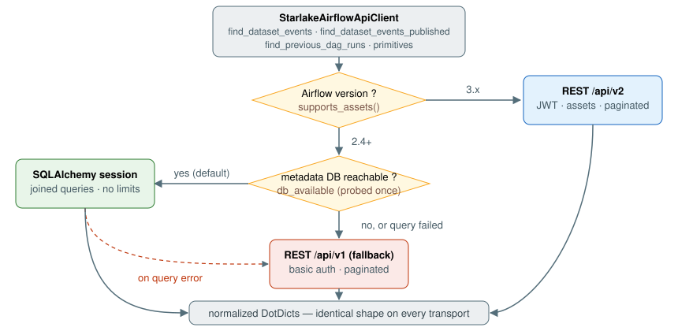

# Airflow 2/3 Compatibility Reference

This document explains, step by step, how `starlake-airflow` accesses Airflow metadata and executes its data-aware scheduling logic, and verifies that:

1. the **Airflow 2** behavior is compliant with the Airflow 2 old implementation (the previous Airflow-2-only, session-based version), and
2. the **Airflow 3** implementation covers every feature implemented for Airflow 2.

It covers the work of issues [#48](https://github.com/starlake-ai/starlake-orchestration/issues/48), [#49](https://github.com/starlake-ai/starlake-orchestration/issues/49), [#50](https://github.com/starlake-ai/starlake-orchestration/issues/50), [#52](https://github.com/starlake-ai/starlake-orchestration/issues/52) and [#53](https://github.com/starlake-ai/starlake-orchestration/issues/53), plus the one deliberate departure from the old implementation: the check of the datasets produced by **non-scheduled** DAGs ([#150](https://github.com/starlake-ai/starlake-orchestration/issues/150), Steps 1, 3b and 4).

For general internals, see [ARCHITECTURE.md](ARCHITECTURE.md).

---

## 1. Design overview

All Airflow metadata lookups (datasets/assets, dataset events, DAG runs, task instances) go through a single access point, `StarlakeAirflowApiClient` ([starlake_airflow_api.py](src/main/python/ai/starlake/airflow/starlake_airflow_api.py)). Its public surface is version-agnostic; the **transport** is an internal detail:

| | Airflow 2.4+ | Airflow 3.x |
|---|---|---|
| Default transport | **metadata database** (SQLAlchemy session, like the old implementation) | **REST `/api/v2`** (the Task SDK removed database access from tasks) |
| Fallback | REST `/api/v1` when the database is unreachable or a query fails | — |
| Authentication | none needed for the database; Basic Auth for the REST fallback (optional `airflow_api` connection, `basic_auth` in `[api] auth_backends`) | JWT bearer token (`POST /auth/token`), or a Google OAuth 2.0 access token on a Google-managed instance |
| Concepts | Datasets, `DatasetEvent` | Assets, `AssetEvent` |

Every transport returns the **same normalized shape**: `DotDict` objects with ISO-8601 timestamp strings, and DAG runs exposing both `run_id` (v2/database naming) and `dag_run_id` (v1 naming). Callers never know which transport served them.

Version gating and all import fallbacks live in one module, [compat.py](src/main/python/ai/starlake/airflow/compat.py) (`supports_datasets()` ≥ 2.4 < 3.0, `supports_inlet_events()` ≥ 2.10, `supports_assets()` ≥ 3.0, `api_prefix()`, plus `BaseHook`, `Dataset`/`Asset`, operators, sensors, `TaskGroup`, `get_current_context`, `TriggerRule`).

---

## 2. Step-by-step: the data-aware scheduling flow

This is the runtime path executed by the `start` task (`ShortCircuitOperator` → `should_continue` → `check_datasets`) of an event-triggered pipeline. Each step lists the old implementation, the new Airflow 2 implementation, and the Airflow 3 implementation.

### Step 0 — Operator construction (`StarlakeDatasetMixin`)

Every Starlake operator passes through the mixin, which:

- attaches the materialized dataset as an Airflow `Dataset`/`Asset` **outlet** with scheduled-date/URI/cron/freshness `extra` (unchanged from the old branch);
- converts `StarlakeDataset` **inlets** to Airflow `Dataset` events (issue #50). Inlets on transform tasks are a new feature (the old implementation never set them); Airflow 2 core wraps `post_execute` with `@apply_lineage`, which JSON-serializes inlets to XCom — only attrs classes (Airflow `Dataset`) survive that. Airflow 3 removed the hook, so both versions now behave the same: the task succeeds and the inlets are visible to lineage on 2.x.

The old branch decorated `pre_execute` with `@prepare_lineage`; the decorator does not exist on Airflow 3 and was dropped. This is inconsequential on Airflow 2: `super().pre_execute(context)` still invokes core's decorated implementation.

### Step 1 — Which datasets triggered this run? (`get_triggering_datasets`)

| | Old implementation | New — Airflow 2 | New — Airflow 3 |
|---|---|---|---|
| Template context key | `triggering_dataset_events` | `triggering_dataset_events` | `triggering_asset_events` |
| Mapping keys | URI strings | URI strings | `Asset`/`AssetAlias` objects, read through their `uri` (#139) |
| Event type check | `isinstance(event, DatasetEvent)` | `type(event).__name__ == "DatasetEvent"` | `type(event).__name__` in `AssetEvent`, `AssetEventDagRunReference`, `AssetEventDagRunReferenceResult` — the task SDK's shape (#139) |
| Result | most recent event per URI, `ts` injected into extra | identical | identical |

The name-based check replaces `isinstance` because importing both event classes on both versions is not possible; the semantics are identical (one check accepts all four class names on both versions).

Since #150 a triggering event whose dataset declares **no cron** is **retained by its presence** — no lookup, whatever `data_cycle` says — where the old implementation looked it up like any non-scheduled dataset (Step 3b). Its presence among the triggering events is Airflow's own proof of publication since the previous asset/dataset-triggered run. Identical on both versions.

### Step 2 — When did this DAG last run successfully? (`find_previous_dag_runs_api`)

Determines `previous_dag_checked` / `last_dag_checked`, the anchor dates for the freshness window. Now a thin wrapper over `client.find_previous_dag_runs(dag_id, scheduled_date, leaf_task_ids, at_scheduled_date)`.

**Old implementation** (`find_previous_dag_runs`, `@provide_session`) — one SQL query:

- `DagRun` where `dag_id = X`, `state = SUCCESS`, `data_interval_end <(=) scheduled_date`;
- **anti-join**: `NOT IN` (subquery of runs joined to `TaskInstance` where a leaf `task_id` is `SKIPPED`);
- `ORDER BY data_interval_end DESC, start_date DESC`.

**New — Airflow 2 (database)**: the *same query*, executed by `_find_previous_dag_runs_db`. Identical filters (including the `<` vs `<=` split on `at_scheduled_date`), identical anti-join, identical ordering, plus one strict improvement: the anti-join subquery is additionally filtered by `dag_id` (same result set, less work). Leaf task ids come from `dag.leaves`, exactly as before.

**New — Airflow 3 (REST)** (`_find_previous_dag_runs_rest`):

1. `GET /api/v2/dags/{dag_id}/dagRuns` with `state=success` and the window translated to `run_after_lt(e)` — the v2 API has no `data_interval_end` filter; `run_after` is its documented equivalent (for scheduled runs it equals the end of the data interval). Fully paginated.
2. `GET .../dagRuns/~/taskInstances?state=skipped` (paginated), leaf membership filtered client-side, excluded runs removed.
3. Final client-side sort by `(data_interval_end, start_date)` descending — the authoritative ordering on every transport.

> Note: an interim version of this branch filtered on `end_date` instead of `data_interval_end` — a semantic drift from the old implementation, corrected by #53 on both transports.

### Step 3 — Which dataset events fall in the checked window? (`find_datasets_events_api`)

The heart of the freshness check. Now a thin wrapper over `client.find_dataset_events(uri, ts, data_interval_end_gt/gte/lte)`.

**Old implementation** (`find_dataset_events`, `@provide_session`) — one SQL query:

- `DatasetEvent ⋈ DagRun` (on `source_dag_id`/`source_run_id`) `⋈ DatasetModel`;
- filters: `DatasetModel.uri = X`, `DatasetEvent.timestamp <= ts`, and the **producing run's** `data_interval_end` inside the checked window (`>= min AND <= scheduled` or `> min AND <= max`, depending on the branch);
- `ORDER BY DagRun.data_interval_end ASC`, dataset eager-loaded;
- **no result limit** — none is needed, because the window filter lives inside the join.

**New — Airflow 2 (database)**: the *same joined query*, executed by `_find_dataset_events_db`. Identical join, filters, ordering and eager-load. Each returned event carries the attached `dataset` (id/uri/extra) and the producing run's `data_interval_end`, matching what downstream `check_datasets` consumes (`event.extra`, `event.dataset.extra`, `event.id`).

This is the property that makes **replay/backfill correct**: the window applies to the *producing run*, never to event recency. Re-running a DAG for a date one year in the past selects exactly the events of that period — there is no "N most recent events" cut anywhere. (An interim version of this branch fetched events by `timestamp` with a `limit` before crossing, which truncated both busy backlogs and old replays; corrected by #53.)

**New — Airflow 3 (REST)** (`_find_dataset_events_rest`):

1. Resolve the asset by URI: `GET /api/v2/assets?uri_pattern=...`, exact match on `uri` (assets are fetched by numeric id in v2).
2. `GET /api/v2/assets/events?asset_id=...&timestamp_lte=...` — `timestamp` filters are native in v2 — fully paginated (**all** matching events, no page cap).
3. For each producing DAG: `GET .../dagRuns` with the window translated to `run_after_gt/gte/lte`, paginated.
4. Cross events × runs on `(source_dag_id, source_run_id)`, attach the dataset and the producing run's `data_interval_end`, sort ascending by it.

Same inputs, same outputs, same replay semantics; the join is computed client-side because the REST API cannot express it.

Since #150 this lookup serves the **scheduled** datasets only (a cron of their own, or a `data_cycle`).

### Step 3b — Which events of a non-scheduled dataset were published in the window? (`find_dataset_events_published_api`)

A **deliberate departure** from the old implementation (#150). The old implementation ran the Step 3 joined query for every dataset, the non-scheduled ones included, around `previous_dag_checked ± freshness`. A non-scheduled producer (a manual, one-shot, bootstrap or replay load) runs without a data interval on Airflow 3 — asset-triggered runs and manual runs without a logical date get `logical_date=None, data_interval=None` — so a correlation on the producing run's `data_interval_end` rested on a field such a run does not have: the check failed, and the transform ended green having executed nothing.

A non-scheduled dataset that did **not** trigger the run is now looked up by **publication time**: its most recently published event in `(P_prev, U]`, where `P_prev` is the previous successful run's trigger time (else its `start_date`, else `previous_dag_checked`) and `U` is this run's trigger time (else `ts`) — `run_after` on Airflow 3, the logical date on Airflow 2; neither moves when a run is cleared. The bound is each event's own `timestamp` (microsecond precision), never the `ts` extra. A thin wrapper over `client.find_dataset_events_published(uri, timestamp_lte=U, timestamp_gt=P_prev)`:

- **Airflow 2 (database)** — `_find_dataset_events_published_db`: one query `DatasetEvent ⋈ DatasetModel` (dataset eager-loaded), filtered on the uri and the timestamp bounds, `ORDER BY timestamp, id`.
- **REST v1 (fallback)** — `get_dataset_by_uri` → `list_events(dataset_id=...)`: v1 has no timestamp filter, so every event of the dataset is paged through and the window applied client-side.
- **REST v2** — asset by `uri_pattern` → `GET /api/v2/assets/events?asset_id=...&timestamp_gte=...&timestamp_lte=...`: Airflow 3.0.x accepts only `timestamp_gte`/`timestamp_lte` (`_gt`/`_lt` exist since 3.1.0) and FastAPI silently ignores an unknown query parameter, so the strict lower bound is sent as `timestamp_gte`, and every bound is re-applied client-side (strict `>` for `timestamp_gt`). `asset_id` → `dataset_id` and `uri` (nullable) → `dataset_uri` are normalized.

Every transport returns the events sorted by `(timestamp, id)`, the dataset attached; an unknown dataset yields none.

### Step 4 — Freshness decision (`check_datasets`)

For the **scheduled** datasets, unchanged from the old branch: walk the returned events in reverse, extract each event's scheduled datetime from `extra` (falling back to the dataset extra), and decide `found`/`missing` per dataset against the cron window. For the **non-scheduled** datasets (#150): a triggering one is retained by its presence (Step 1); a non-triggering one is found when Step 3b returns an event — its readable `sl_scheduled_date` raises the pushed interval end with no `freshness` cap, and an event without one counts as present. Works identically on both versions because Steps 2–3b deliver the identical normalized inputs.

---

## 3. The client primitives, per version

The joined lookups are built on four primitives, each verified against the published OpenAPI specifications (v1: Airflow 2.10 `api_connexion`; v2: `v2-rest-api-generated.yaml`).

### `get_dataset_by_uri(uri)`

| Transport | Mechanics |
|---|---|
| Database (2.x) | `SELECT` on `DatasetModel` by uri |
| REST v1 | `GET /datasets/{uri}` — uri **percent-encoded** (`quote(uri, safe="")`), 404 → `None` |
| REST v2 | `GET /assets?uri_pattern=...` + exact match (v2 fetches assets by id, not uri) |

### `list_events(**params)`

| Aspect | Database (2.x) | REST v1 | REST v2 |
|---|---|---|---|
| id filter | `dataset_id` (accepts `asset_id`, translated) | `dataset_id` (translated) | `asset_id` (translated) |
| `timestamp_gte/lte` | SQL | **not supported by the API** → applied client-side after full pagination | native (`timestamp_gt/lt` only since 3.1.0 — never sent: 3.0.x would silently ignore them) |
| Response key | — | `dataset_events` | `asset_events` |
| Pagination | not needed | `total_entries` offset loop | `total_entries` offset loop |

### `find_dataset_events_published(uri, timestamp_lte, timestamp_gt=None, timestamp_gte=None)` (#150)

Not a primitive but the second joined lookup, next to `find_dataset_events`; bounded on the event's own `timestamp`.

| Transport | Mechanics |
|---|---|
| Database (2.x) | one query `DatasetEvent ⋈ DatasetModel` on the uri and the timestamp bounds, `ORDER BY timestamp, id` |
| REST v1 | `get_dataset_by_uri` → `list_events` (all events of the dataset, no timestamp filter) → window applied client-side |
| REST v2 | `get_dataset_by_uri` → `list_events(asset_id, timestamp_gte=<gt or gte>, timestamp_lte)` → every bound re-applied client-side, v2 keys normalized |

### `list_dag_runs(dag_id, **params)`

| Aspect | Database (2.x) | REST v1 | REST v2 |
|---|---|---|---|
| `data_interval_end_gt/gte/lt/lte` | SQL | not supported → client-side | translated to `run_after_*` (documented equivalent) |
| `end_date_lt` | SQL | not supported → client-side | native |
| `end_date_lte`, `state` | SQL | native | native |
| `order_by` | multi-column SQL | single field; `data_interval_end` → `execution_date` proxy | list passed through (multi-criteria); `data_interval_end` → `run_after`, `execution_date` → `logical_date` |
| Run id field | `run_id` + `dag_run_id` alias | `dag_run_id` + `run_id` alias | `run_id` + `dag_run_id` alias |

### `list_task_instances` / `list_dag_task_instances`

| Aspect | Database (2.x) | REST v1 | REST v2 |
|---|---|---|---|
| `task_id` | SQL | not supported → client-side | native |
| `state` | SQL (`IN`) | native (normalized to a list) | native |
| `end_date_lte` | SQL | native | native |
| `order_by` | SQL | **not supported** → dropped (callers only membership-test) | native (first field) |

All REST collection reads go through `_get_paged`: a `total_entries`-driven offset loop with page size capped at the API maximum (100), so `[api] maximum_page_limit` can never silently truncate a result. When a response carries no `total_entries`, a short page ends the loop.

---

## 4. Compliance matrix vs the Airflow 2 old implementation

| Feature | Old | New (Airflow 2) | Status |
|---|---|---|---|
| Previous-runs lookup | 1 SQL query, anti-join | same query via the client | ✅ identical (+ tighter subquery) |
| Window filter column | `data_interval_end` | `data_interval_end` | ✅ identical |
| Dataset-events lookup (scheduled datasets) | 1 joined SQL query, window in the join, no limit | same query via the client | ✅ identical |
| Triggering event whose dataset declares no cron | looked up like any non-scheduled dataset | retained by its presence, no lookup (#150) | ➖ deliberate departure |
| Non-scheduled datasets that did not trigger the run | the joined query, window on the producing run's `data_interval_end` around `previous_dag_checked ± freshness` | 1 query on the event's own `timestamp` in `(P_prev, U]`, trigger times (#150) | ➖ deliberate departure |
| Replay of arbitrarily old dates | ✅ (window in join) | ✅ (window in join) | ✅ identical |
| Ordering | SQL (`data_interval_end`) | SQL, same clauses | ✅ identical |
| Result objects | ORM rows, native datetimes | `DotDict`, ISO-8601 strings | ⚠️ equivalent — consumers parse via `ts_as_datetime` (they already did for REST) |
| Session usage | one `@provide_session` session per check | one `create_session` per client call | ⚠️ equivalent — a few more sub-millisecond checkouts from the same pool; no cross-query snapshot (irrelevant: append-only tables) |
| `@prepare_lineage` on `pre_execute` | explicit | dropped (absent in Airflow 3); core still applies it | ✅ equivalent |
| Triggering events | `triggering_dataset_events` + `isinstance(DatasetEvent)` | same key, name-based type check | ✅ equivalent |
| Deployment requirements | database access only | database access only (REST fallback optional) | ✅ identical |
| Inlets on transform tasks | none | `StarlakeDataset` → `Dataset` conversion | ➕ new feature, made 2.x-safe (#50) |

## 5. Airflow 3 coverage of the Airflow 2 feature set

| Feature | Airflow 3 mechanism | Caveat |
|---|---|---|
| Datasets | Assets (`compat.Dataset = airflow.sdk.Asset`) | none — same constructor shape (`uri`, `extra`) |
| Triggering events | `triggering_asset_events` / `AssetEvent` | none |
| Previous-runs lookup | REST composition, `run_after` window, paginated skipped-leaf exclusion | `run_after == data_interval_end` for **scheduled** runs; for asset-triggered runs `run_after` is the trigger time and `data_interval_end` may be null — the client-side final sort treats nulls last |
| Dataset-events lookup | REST composition (asset by uri_pattern → events by timestamp → runs by run_after window → client-side join) | complete (paginated) but O(#producing DAGs + pages) HTTP calls where Airflow 2 does 1 SQL query |
| Non-scheduled datasets lookup (#150) | REST composition (asset by uri_pattern → events by `timestamp_gte`/`timestamp_lte`, bounds re-applied client-side) | none — no producing run is involved, so a run without a data interval is no obstacle |
| Replay of old dates | ✅ window on the producing run, native `timestamp_lte`, full pagination | none |
| Authentication | JWT bearer (`/auth/token`), Google access token (ADC) on a managed instance | requires api-server reachability from workers; a Google-managed instance runs no auth manager, so `/auth/token` and the `airflow_api` connection have no object there |
| Lineage inlets XCom | hook removed in Airflow 3 | conversion in the mixin is a no-op there — harmless |
| Runtime `sl_options` fragment | context key selected at DAG-build time: `triggering_asset_events` (3.x) / `triggering_dataset_events` (2.x) — #54 | none |
| Pipeline lifecycle (`run()`, `delete()`) | routed through the client: `trigger_dag_run`/`get_dag_run`/`delete_dag` on `/api/v2` + JWT (v1 + basic auth on 2.x) — #55 | v2 trigger body requires the nullable `logical_date` key (handled) |

## 6. Known behavioral differences (both directions)

- **Timestamps are ISO strings**, not datetimes, in everything the client returns. All in-tree consumers parse them (`ts_as_datetime`, `_as_datetime`); new consumers must too.
- **REST v1 fallback for events is heavy**: v1 has no timestamp filter, so the fallback paginates *all* events of the dataset before filtering client-side — for both joined lookups, `find_dataset_events` and `find_dataset_events_published`. This path only runs when the Airflow 2 database is unreachable — an unusual deployment.
- **The strict lower bound of `find_dataset_events_published` is never sent to `/api/v2`**: Airflow 3.0.x accepts only `timestamp_gte`/`timestamp_lte` and FastAPI ignores an unknown query parameter, which would silently widen the window. `timestamp_gte` is sent instead and every bound is re-applied client-side, so the result is identical on every 3.x.
- **`order_by` on v1 is single-field** and cannot sort by `data_interval_end`; the `execution_date` proxy is correct for schedule-generated runs. The joined lookups do not rely on server ordering — the final client-side sort is authoritative.
- The dead legacy branch calling the removed SQLAlchemy `find_dataset_events` (an undefined name that would have raised `NameError`) was removed from `check_datasets`.

## 7. Related parity fixes on this branch

| Issue | Fix |
|---|---|
| #48 | `compat.py` single point for every Airflow 2/3 import fallback and version helper; API client works on both versions (response keys, uri encoding, id translation) |
| #49 | `--options` value double-quoted in generated bash commands (spaces in injected env vars, e.g. macOS `Application Support` PATH entries) |
| #50 | `StarlakeDataset` inlets converted to Airflow `Dataset` (Airflow 2 lineage XCom serialization) |
| #52 | database-first transport, optional `airflow_api` connection on 2.x |
| #53 | joined lookups (this document), REST pagination, `data_interval_end` semantics restored |
| #54 | `sl_transform` runtime options fragment built with the version-appropriate triggering-events context key |
| #55 | `AirflowPipeline.run()`/`delete()` routed through `StarlakeAirflowApiClient` (version-appropriate API and auth, explicit `base_url`/credential overrides) |
| #150 | datasets produced by non-scheduled DAGs: a cron-less triggering event is retained by its presence; a cron-less dependency that did not trigger the run is found by publication time, `(previous successful run's trigger time, this run's trigger time]`, through the new `find_dataset_events_published` (three transports); the anchor key uses an aware minimum. Scheduled datasets unchanged (#151) |

## 8. Verification

Claim-to-test mapping, all in [tests/airflow/test_airflow_api_client.py](../tests/airflow/test_airflow_api_client.py) unless noted:

| Claim | Test |
|---|---|
| Version gating (2.3/2.4/2.10/3.0) | `test_version_helpers` |
| Auth per version | `test_basic_auth_and_v1_prefix_on_airflow_2`, `test_bearer_auth_and_v2_prefix_on_airflow_3` |
| URI encoding (v1) / uri_pattern (v2) | `test_get_dataset_by_uri_*` |
| Response keys + id translation | `test_list_events_reads_*` |
| v1 client-side filters, v2 `run_after` translation, order_by proxying | `test_list_dag_runs_*`, `test_list_task_instances_v1_*` |
| Pagination across pages | `test_rest_requests_paginate_until_total_entries` |
| Database transport selection + REST fallback on error | `test_list_events_uses_database_when_available`, `test_list_events_falls_back_to_rest_on_database_error` |
| Joined window query (real seeded metadata DB) | `TestDatabaseTransport::test_find_dataset_events_joined_window` |
| **Replay of a past window** | `TestDatabaseTransport::test_find_dataset_events_replay_past_window` |
| Anti-join on skipped leaves | `TestDatabaseTransport::test_find_previous_dag_runs_anti_join` |
| REST composition end-to-end (v3) | `test_find_dataset_events_rest_composition_on_airflow_3` |
| Publication-time lookup: SQL bounds, strictness, order, attached dataset (#150) | `TestDatabaseTransport::test_find_dataset_events_published_*` |
| Publication-time lookup over REST: v2 never sends `timestamp_gt`, bounds re-applied client-side, keys normalized; v1 sends no timestamp filter; unknown dataset; transport selection (#150) | `test_find_dataset_events_published_*` |
| Cron-less triggering event retained by its presence, whatever `data_cycle` says; sd-less or unreadable dates tolerated (#150) | [tests/airflow/test_airflow_dataset_check_event_first.py](../tests/airflow/test_airflow_dataset_check_event_first.py) `TestNonScheduledTriggeringEvent` |
| Non-triggering cron-less dependency found by publication time in `(P_prev, U]`; replay-stable (#150) | same module, `TestNonTriggeringPublicationLookup` |
| Scheduled datasets, the pushed interval start and the silent skip unchanged (#150) | same module, `TestScheduledDatasetsUnchanged`, `TestPreviousDagCheckedUnchanged`, `TestNoGuardRail` |
| Optional connection on 2.x | `test_client_tolerates_missing_connection_on_airflow_2` |
| End-to-end via `dag.test()` on Airflow 2.10.5 (live metadata DB) | [tests/airflow/test_airflow_runtime.py](../tests/airflow/test_airflow_runtime.py) — 7/7 passing |
