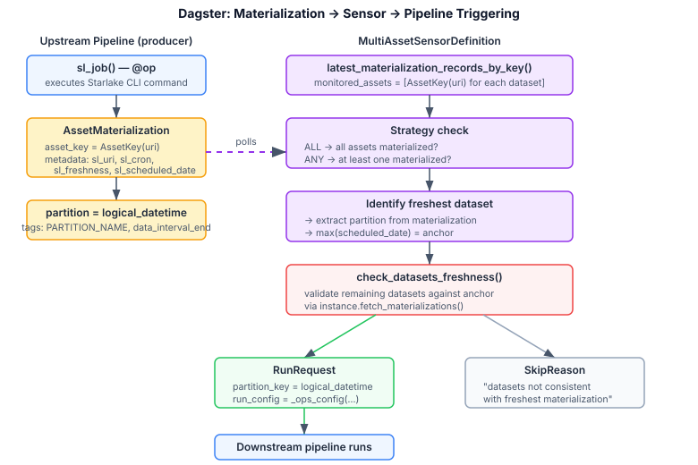
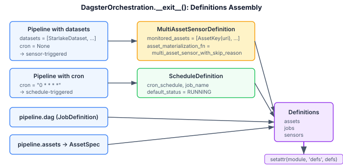
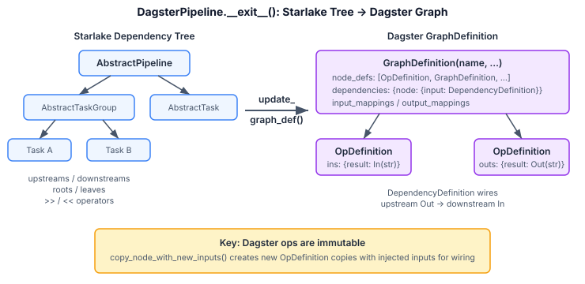

# Starlake Dagster — Architecture Reference

This document describes the internal architecture of the `starlake-dagster` module. It is intended for contributors, AI agents, and anyone extending the framework.

For usage documentation, see [README.md](README.md).
For core module architecture, see [starlake-orchestration/ARCHITECTURE.md](../starlake-orchestration/ARCHITECTURE.md).

## Role Within the Framework

The Dagster module concretizes the core `starlake-orchestration` abstractions for Dagster:

| TypeVar | Dagster Concrete Type |
|---------|----------------------|
| `U` (pipeline) | `JobDefinition` |
| `T` (task) | `NodeDefinition` (concretely `OpDefinition`) |
| `GT` (task group) | `GraphDefinition` |
| `E` (event) | `AssetKey` |

## Package Structure

```
ai.starlake.dagster/
├── starlake_dagster_job.py             StarlakeDagsterJob, DagsterDataset, StarlakeDagsterUtils,
│                                       DagsterLogicalDatetimeConfig
├── starlake_dagster_orchestration.py   DagsterOrchestration, DagsterPipeline
├── shell/
│   └── starlake_dagster_shell_job.py   StarlakeDagsterShellJob
├── gcp/
│   ├── starlake_dagster_cloud_run_job.py   StarlakeDagsterCloudRunJob
│   └── starlake_dagster_dataproc_job.py    StarlakeDagsterDataprocJob
└── aws/
    └── starlake_dagster_fargate_job.py     StarlakeDagsterFargateJob
```

## Key Architectural Difference from Airflow

In Airflow, tasks auto-register with the current DAG context and dependencies are wired via `set_upstream()`. In Dagster, the dependency graph must be **explicitly constructed** as a `GraphDefinition` with `node_defs`, `dependencies` (`DependencyDefinition` dict), `input_mappings`, and `output_mappings`. Additionally, Dagster ops are **immutable** — adding inputs requires creating a new `OpDefinition` copy.

This means `DagsterPipeline.__exit__()` must walk the entire Starlake dependency tree and translate it into Dagster's declarative graph model — a heavier transformation than Airflow's `set_upstream()` calls.

## Asset Materialization & Sensor-Driven Triggering

This is the central mechanism for data-aware pipeline scheduling in Dagster. Unlike Airflow where `start_op()` queries the DB at runtime inside a `ShortCircuitOperator`, Dagster uses a **sensor** that polls materialization records externally and decides whether to submit a `RunRequest`.



### How It Works

**1. Upstream pipeline produces materializations**

Each execution environment's `sl_job()` creates an `@op` that, on success, yields:
- `AssetMaterialization(asset_key=AssetKey(uri))` with metadata: `sl_uri`, `sl_cron`, `sl_freshness`, `sl_scheduled_date`, `sl_dry_run`
- The materialization is tagged with `partition = logical_datetime` (the scheduled date formatted as `sl_timestamp_format`)

The `StarlakeDagsterUtils.get_materialization()` method builds these materializations with full metadata and partition tags, including `PARTITION_NAME_TAG` and `data_interval_end`.

**2. Sensor monitors upstream assets**

In `DagsterOrchestration.__exit__()`, for each pipeline with datasets, a `MultiAssetSensorDefinition` is created:
- `monitored_assets` = `[AssetKey(uri) for each dataset]`
- `minimum_interval_seconds` = 60
- `asset_materialization_fn` = `multi_asset_sensor_with_skip_reason`

**3. Sensor evaluation logic** (`multi_asset_sensor_with_skip_reason`)

The sensor function runs on each evaluation cycle:

1. **Retrieve latest materializations** via `context.latest_materialization_records_by_key()`
2. **Strategy gate**: check `DatasetTriggeringStrategy.ANY` (at least one materialized) or `.ALL` (all materialized). If not met → `SkipReason`
3. **Extract partition dates** from materialization records via `get_dataset_and_partition()` — reads `partition_key`, `tags`, or `metadata[sl_scheduled_date]`
4. **Identify anchor**: find the materialized dataset with the **greatest scheduled date** (`max(materialized_schedules)`)
5. **Build checking set**: remaining datasets = not-materialized + older-materialized (excluding the anchor)
6. **Validate freshness** via `check_datasets_freshness()` (detailed below)
7. **Result**:
   - All consistent → `RunRequest(run_config=_ops_config(logical_datetime, previous_logical_datetime), partition_key=logical_datetime, tags={...})` + `context.advance_cursor()`
   - Missing/inconsistent → `SkipReason`

**4. `check_datasets_freshness()` — Validation Engine**

This is the Dagster equivalent of Airflow's `check_datasets()`. Same logical phases but uses **Dagster's public API** (no direct DB access):

| Step | Method | API Used |
|------|--------|----------|
| Find previous successful partition | `get_previous_partition()` | `instance.get_runs(RunsFilter(job_name, statuses=[SUCCESS]))` |
| Retrieve materialization events | `find_dataset_events()` | `instance.fetch_materializations(AssetRecordsFilter)` |
| Extract partition from event | `get_event_partition()` | `event.partition_key` or `event.asset_materialization.metadata` |

Per-dataset validation follows the same pattern as Airflow:
- Compute `(min, max)` window from `scheduled_dates_range(cron, scheduled_date)`
- **Optional datasets**: skip if frequency > data_cycle frequency
- **Beyond-data-cycle**: extend window by ±freshness seconds
- **Scheduled datasets**: check triggering partition in window, then query historical materializations
- **Non-scheduled datasets**: check materializations between `previous_partition - freshness` and `scheduled_date + freshness`

Returns `(checked: bool, previous_partition, max_scheduled_date, missing_datasets)`.

### Partition Date Encoding

Dagster partition keys cannot contain `:` or `+`, so `StarlakeDagsterUtils` provides encoding:
- `quote_datetime()`: `2026-03-23T14:30:00+00:00` → `2026-03-23T14.30.00_00.00`
- `unquote_datetime()`: reverses the encoding

## Definitions Assembly



`DagsterOrchestration.__exit__()` assembles all Dagster definitions and dynamically binds them to the caller's module via `setattr(module, 'defs', defs)`. This is how Dagster discovers the definitions when loading the module.

For cron-scheduled pipelines, a `ScheduleDefinition` is created instead of a sensor. Both paths produce a `JobDefinition` from the pipeline's graph.

## Graph Construction



`DagsterPipeline.__exit__()` calls `update_graph_def()` recursively to transform the Starlake dependency tree into Dagster's `GraphDefinition`:

1. **Walk roots downstream** via `walk_downstream()`: for each upstream → downstream pair, create `DependencyDefinition` entries that wire the upstream's `Out` to the downstream's `In`
2. **Handle task groups**: for `AbstractTaskGroup` nodes, recurse into the group and create `InputMapping` / `OutputMapping` to connect the group's boundary nodes
3. **Inject inputs**: since Dagster ops are immutable, `copy_node_with_new_inputs()` creates new `OpDefinition` copies with the additional inputs needed for wiring
4. **Build output mappings**: leaf nodes' outputs are exposed as the graph's outputs via `OutputMapping`
5. **Create `GraphDefinition`** with `node_defs`, `dependencies`, `input_mappings`, `output_mappings`

After graph construction, if the pipeline has a cron schedule, a `PartitionedConfig` with `TimeWindowPartitionsDefinition` is created to enable time-partitioned execution. The final `JobDefinition` is created with the graph and optional partition config.

## Class Reference

### Event & Utility Layer

#### `DagsterDataset` (extends `AbstractEvent[AssetKey]`)

`to_event(dataset)` → `AssetKey(dataset.uri)`. Simple key — metadata is carried by `AssetMaterialization`, not the key itself.

#### `DagsterLogicalDatetimeConfig` (extends `dagster.Config`)

Run configuration schema injected into every `@op`: `logical_datetime` (str), `previous_logical_datetime` (optional str), `dry_run` (bool, default False).

#### `StarlakeDagsterUtils`

Static utilities — replaces Airflow's Jinja2 macros with explicit runtime calls:
- `get_logical_datetime(context, config)` — resolves from: partition key → config → run launch time → now
- `get_materialization(context, config, dataset)` — builds `AssetMaterialization` with full metadata and partition tags
- `get_transform_options(context, config, params)` — computes `sl_data_interval_start` / `sl_data_interval_end`
- `quote_datetime()` / `unquote_datetime()` — partition key encoding

### Job Layer

#### `StarlakeDagsterJob` (extends `IStarlakeJob[NodeDefinition, AssetKey]`, `StarlakeOptions`, `DagsterDataset`)

Base job factory. Unlike Airflow, does NOT override `get_context_var()` (no Dagster Variable equivalent).

- `sl_orchestrator()` → `StarlakeOrchestrator.DAGSTER`
- `sl_pre_load()` — adds `skip_or_start=True`, `retries=0` when strategy ≠ NONE
- `dummy_op()` — `@op` yielding `Output(value=task_id)` + `AssetMaterialization` per event

### Orchestration Layer

#### `DagsterPipeline` (extends `AbstractPipeline[JobDefinition, OpDefinition, GraphDefinition, AssetKey]`, `DagsterDataset`)

- `__exit__()` — graph construction + `JobDefinition` creation (see Graph Construction above)
- `_ops_config()` — recursively walks graph to build config dict with `logical_datetime` for every op
- `sl_transform_options()` — returns `None` (handled at runtime in `sl_job()` via `StarlakeDagsterUtils`)
- `run()` — uses `DagsterInstance.ephemeral()` + `job.execute_in_process()`. In dry_run, also validates dataset freshness.

#### `DagsterOrchestration` (extends `AbstractOrchestration[JobDefinition, OpDefinition, GraphDefinition, AssetKey]`)

- `__exit__()` — creates sensors/schedules, assembles `Definitions`, binds to module (see Definitions Assembly above)
- `sl_create_task_group()` — returns `AbstractTaskGroup` with `GraphDefinition(name=group_id)` (no separate `DagsterTaskGroup` class)
- `from_native()` — `OpDefinition` → `AbstractTask`, `GraphDefinition` → `AbstractTaskGroup`

### Execution Environment Jobs

All share the same `@op` pattern: resolve `logical_datetime` → prepend `--scheduledDate` → execute → yield `AssetMaterialization` + `Output` on success, `Failure` on error. All support `skip_or_start` (silent skip on failure), `retry_policy`, and `dry_run` mode.

| Environment | Class | How `sl_job()` Executes CLI | Pre/Post Tasks |
|-------------|-------|-----------------------------|----------------|
| Shell | `StarlakeDagsterShellJob` | `dagster_shell.execute_shell_command()` with merged env vars and `--options` | None |
| Cloud Run | `StarlakeDagsterCloudRunJob` | `gcloud beta run jobs execute --wait` via `execute_shell_command()` (sync only) | None |
| Dataproc | `StarlakeDagsterDataprocJob` | `DataprocClient.submit_job()` via `dagster_gcp.DataprocResource` | `pre_tasks()`: create cluster / `post_tasks()`: delete cluster |
| Fargate | `StarlakeDagsterFargateJob` | `StarlakeFargateHelper.generate_script()` → `dagster_shell.execute_shell_script()` (sync only) | None |

Note: unlike Airflow, Dagster execution environments are all **synchronous** — no async sensor pattern.

## Public API Exports

**`ai.starlake.dagster`**: `StarlakeDagsterJob`, `DagsterDataset`, `StarlakeDagsterUtils`, `DagsterLogicalDatetimeConfig`, `DagsterPipeline`, `DagsterOrchestration`

**`ai.starlake.dagster.shell`**: `StarlakeDagsterShellJob`

**`ai.starlake.dagster.gcp`**: `StarlakeDagsterCloudRunJob`, `StarlakeDagsterDataprocJob`

**`ai.starlake.dagster.aws`**: `StarlakeDagsterFargateJob`
