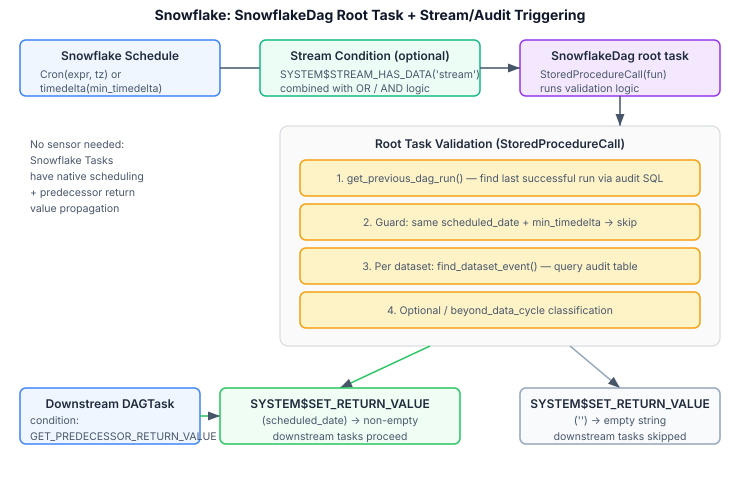
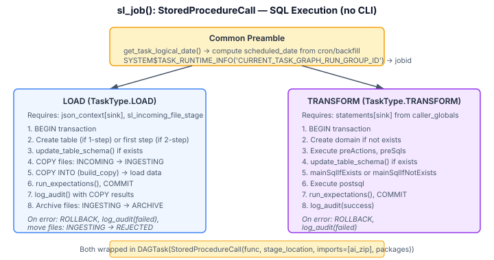

# Starlake Snowflake — Architecture Reference

This document describes the internal architecture of the `starlake-snowflake` module. It is intended for contributors, AI agents, and anyone extending the framework.

For usage documentation, see [README.md](README.md).
For core module architecture, see [starlake-orchestration/ARCHITECTURE.md](../starlake-orchestration/ARCHITECTURE.md).

## Role Within the Framework

The Snowflake module is fundamentally different from Airflow and Dagster: **there is no external orchestrator**. Snowflake Tasks ARE the orchestrator. The Starlake CLI is NOT invoked — instead, load and transform logic runs as **Snowflake Stored Procedures** (Python UDFs) executing SQL directly within Snowflake.

| TypeVar | Snowflake Concrete Type |
|---------|------------------------|
| `U` (pipeline) | `SnowflakeDag` (extends `snowflake.core.task.dagv1.DAG`) |
| `T` (task) | `snowflake.core.task.dagv1.DAGTask` |
| `GT` (task group) | `List[DAGTask]` |
| `E` (event) | `StarlakeDataset` (identity — no separate event type) |

## Package Structure

```
ai.starlake.snowflake/
├── starlake_snowflake_job.py            StarlakeSnowflakeJob, SnowflakeEvent
├── starlake_snowflake_orchestration.py  SnowflakeOrchestration, SnowflakePipeline, SnowflakeDag,
│                                        SnowflakeTaskGroup, SnowflakeTaskResult, SnowflakeDagResult
└── exceptions.py                        StarlakeSnowflakeError
```

Only **one execution environment**: `StarlakeExecutionEnvironment.SQL`. No Shell/Cloud Run/Dataproc/Fargate — everything runs as Snowflake stored procedures.

## Key Architectural Differences from Airflow/Dagster

1. **No Starlake CLI**: `sl_job()` generates `StoredProcedureCall` Python functions that execute SQL directly via Snowpark `Session`, not shell commands. The `statements` and `json_context` dicts (from `caller_globals`) contain the pre-generated SQL to execute.
2. **No external sensor**: Snowflake Tasks have native scheduling (`Cron` or `timedelta`) and predecessor return value propagation (`SYSTEM$GET_PREDECESSOR_RETURN_VALUE`). Dataset validation runs in the **root task** itself.
3. **Stream-based triggering**: Snowflake Streams (`SYSTEM$STREAM_HAS_DATA`) provide CDC-like change detection as an alternative or complement to audit-based validation.
4. **Task group = `List[DAGTask]`**: No native task grouping in Snowflake Tasks — groups are represented as plain lists.
5. **`SnowflakeEvent` is identity**: `to_event()` returns the `StarlakeDataset` unchanged — no conversion to an external event type.

## Pipeline Triggering & Dataset Validation



### How It Works

**1. Schedule**: `SnowflakeDag` is always scheduled — either with a `Cron` expression or a `timedelta(seconds=min_timedelta_between_runs)` fallback. Unlike Airflow/Dagster, there is no "unscheduled" mode.

**2. Stream conditions** (optional): If upstream datasets have associated Snowflake Streams, a `condition` is built:
- Most-frequent dataset streams: combined with `OR` (any change triggers)
- Non-scheduled dataset streams: combined with `AND` (all must have data)
- Mixed: `(stream1 OR stream2) AND (stream3 AND stream4)`

This condition is set on the `SnowflakeDag` root task — Snowflake evaluates it before executing.

**3. Root task validation** (`SnowflakeDag.__init__` → `fun()`):

The root task's `StoredProcedureCall` runs the validation logic as a Python stored procedure within Snowflake:

1. **Baseline**: `get_previous_dag_run()` queries the Starlake audit table for the last successful run
2. **Guard**: if same `scheduled_date` and not manual and not backfill → skip. If manual but within `min_timedelta_between_runs` → skip
3. **Per-dataset validation**: for each tracked dataset (from `least_frequent_datasets`, `not_scheduled_datasets`, `most_frequent_datasets`):
   - `check_if_dataset_exists()` — verify the dataset table exists
   - Same optional/beyond_data_cycle classification as Airflow/Dagster
   - `find_dataset_event()` — query the **Starlake audit table** (not Snowflake's internal metadata) for matching events within the computed time window
4. **Result propagation**:
   - All datasets present → `SYSTEM$SET_RETURN_VALUE(scheduled_date)` (non-empty string)
   - Missing datasets → `SYSTEM$SET_RETURN_VALUE('')` (empty string)

**4. Downstream gating**: All downstream `DAGTask` nodes have `condition = "SYSTEM$GET_PREDECESSOR_RETURN_VALUE() <> ''"` set by `start_op()`. This skips the entire pipeline if the root task returned an empty string.

### Comparison with Airflow/Dagster

| Aspect | Airflow | Dagster | Snowflake |
|--------|---------|---------|-----------|
| Trigger mechanism | `ShortCircuitOperator` (runtime) | `MultiAssetSensorDefinition` (polling) | Root task `StoredProcedureCall` (scheduled) |
| Dataset event source | `DatasetEvent` DB table (SQLAlchemy) | `AssetMaterialization` (public API) | Starlake audit table (SQL) + Snowflake Streams |
| Skip mechanism | ShortCircuit skips downstream | `SkipReason` prevents `RunRequest` | Empty `SYSTEM$SET_RETURN_VALUE` + condition check |
| Schedule fallback | None (cron or dataset-only) | None (cron or sensor-only) | `timedelta` (always scheduled) |

## Task Execution: `sl_job()` as StoredProcedureCall



Unlike Airflow/Dagster where `sl_job()` invokes the Starlake CLI, the Snowflake module executes **SQL directly** within Snowflake via stored procedures. The SQL statements come from the calling module's globals (`statements`, `json_context`), which are generated by `starlake dag-generate`.

### TRANSFORM execution

`sl_job()` creates a `StoredProcedureCall` wrapping a Python function that:
1. Resolves `logical_date` from `get_task_logical_date()` or backfill partition info (`SYSTEM$TASK_RUNTIME_INFO`)
2. Computes `sl_data_interval_start`/`sl_data_interval_end` from cron or backfill
3. Within a BEGIN/COMMIT transaction:
   - Creates domain if not exists
   - Executes `preActions`, `preSqls`
   - `update_table_schema()` for schema evolution
   - `mainSqlIfExists` or `mainSqlIfNotExists` (the core transform SQL)
   - SCD2 column additions if needed
   - `postsql` post-processing
   - `run_expectations()` for data quality
4. Logs to audit table via `log_audit()`
5. On error: ROLLBACK + error audit

### LOAD execution

`sl_job()` creates a `StoredProcedureCall` that:
1. Same logical_date/cron resolution
2. Supports 1-step or 2-step loading (controlled by `statements['steps']`)
3. Within a transaction:
   - Creates table, updates schema
   - `copy_files()`: INCOMING → INGESTING (moves files between Snowflake stages)
   - `build_copy()`: generates and executes `COPY INTO` command
   - For 2-step: second step handles SCD2, schema evolution, merge logic
   - `run_expectations()`, post-SQL
4. Audit logging with COPY result metrics (rows_parsed, rows_loaded, errors_seen)
5. On success: archive files (INGESTING → ARCHIVE)
6. On error: ROLLBACK + reject files (INGESTING → REJECTED)

### Key helper classes

Both LOAD and TRANSFORM use helper classes from `ai.starlake.helper`:
- `SnowflakeTaskHelper` / `SnowflakeLoadTaskHelper` — provide SQL execution, audit logging, schema management, expectations
- `SnowflakeDAGHelper` — provides `get_previous_dag_run()`, `find_dataset_event()`, `get_dag_logical_date()` for root task validation
- `zip_selected_packages()` — packages the `ai` module as a zip for upload to Snowflake stage (`imports=[(ai_zip, 'ai')]`)

## Class Reference

### `SnowflakeEvent` (extends `AbstractEvent[StarlakeDataset]`)

Identity transform: `to_event(dataset)` → returns `dataset` unchanged. Snowflake has no separate event type.

### `StarlakeSnowflakeJob` (extends `IStarlakeJob[DAGTask, StarlakeDataset]`, `StarlakeOptions`, `SnowflakeEvent`)

- `sl_orchestrator()` → `StarlakeOrchestrator.SNOWFLAKE`
- `sl_execution_environment()` → `StarlakeExecutionEnvironment.SQL`
- **Properties**: `stage_location`, `warehouse`, `packages` (croniter, python-dateutil, snowflake-snowpark-python + custom), `allow_overlapping_execution`, `sl_incoming_file_stage`, `ai_zip`
- `dummy_op()` — `DAGTask(definition="select '{task_id}'")`
- `start_op()` — delegates to parent but adds `condition = "SYSTEM$GET_PREDECESSOR_RETURN_VALUE() <> ''"` for downstream gating
- `skip_or_start_op()` — `DAGTask` with `StoredProcedureCall` that reads predecessor return value via `TaskContext.get_predecessor_return_value()` and raises `ValueError` on failure
- `sl_load()` — if `run_dependencies_first`, returns a dummy task (actual loading handled by dependency pipeline). Otherwise adds `sink` kwarg and delegates.
- `sl_transform()` — adds `sink` kwarg and delegates
- `sl_job()` — the core method: creates `DAGTask(StoredProcedureCall(...))` for LOAD or TRANSFORM. Only these two task types are implemented; others raise `NotImplementedError`.

### `SnowflakeDag` (extends `snowflake.core.task.dagv1.DAG`)

Custom DAG class that wraps the validation logic into the root task's `StoredProcedureCall`. Constructor parameters include all dataset lists, scheduling config, and stream/audit validation setup. The `_to_low_level_task()` method converts to a standard Snowflake `Task` for deployment.

### `SnowflakePipeline` (extends `AbstractPipeline[SnowflakeDag, DAGTask, List[DAGTask], StarlakeDataset]`)

- **Constructor**: creates `SnowflakeDag` with schedule, datasets, streams, and validation config. DAG dependency wiring uses `upstream.add_successors(downstream)`.
- **Context manager**: pushes/pops `_dag_context_stack` (Snowflake's internal DAG context)
- **`deploy()`** — creates Snowflake stage, then `DAGOperation.deploy(dag, mode=or_replace)` via Snowpark
- **`delete()`** — `DAGOperation.delete(pipeline_id)`
- **`run()`**:
  - `DRY_RUN`: calls each `StoredProcedureCall.func(session, dry_run=True)` locally
  - `RUN`: suspends task → sets CONFIG → resumes → executes → polls `INFORMATION_SCHEMA.TASK_HISTORY()` until completion
  - `BACKFILL`: delegates to RUN mode
- **`backfill()`** — if `allow_overlapping_execution` and no streams: calls `SYSTEM$TASK_BACKFILL()` stored procedure with partition range. Otherwise falls back to parent's croniter-based loop.

### `SnowflakeTaskGroup` (extends `AbstractTaskGroup[List[DAGTask]]`)

Simple wrapper — Snowflake has no native task grouping, so groups are `List[DAGTask]`.

### `SnowflakeOrchestration` (extends `AbstractOrchestration[SnowflakeDag, DAGTask, List[DAGTask], StarlakeDataset]`)

- `sl_orchestrator()` → `StarlakeOrchestrator.SNOWFLAKE`
- `sl_create_task()` — assigns `task._dag = pipeline.dag`. For lists (task groups), creates `SnowflakeTaskGroup` and recursively visits with predecessor wiring.
- `sl_create_task_group()` — returns `SnowflakeTaskGroup(group_id, group=[])`
- `from_native()` — `List` → `SnowflakeTaskGroup`, `DAGTask` → `AbstractTask`

### `SnowflakeTaskResult` / `SnowflakeDagResult`

Runtime status tracking for `run()` mode — tracks task states (EXECUTING, SUCCEEDED, FAILED, SKIPPED) by polling `INFORMATION_SCHEMA.TASK_HISTORY()`.

### `StarlakeSnowflakeError`

Base exception with `message` and `error_code` properties.

## Public API Exports

**`ai.starlake.snowflake`**: `StarlakeSnowflakeJob`, `SnowflakeOrchestration`, `StarlakeSnowflakeError`
